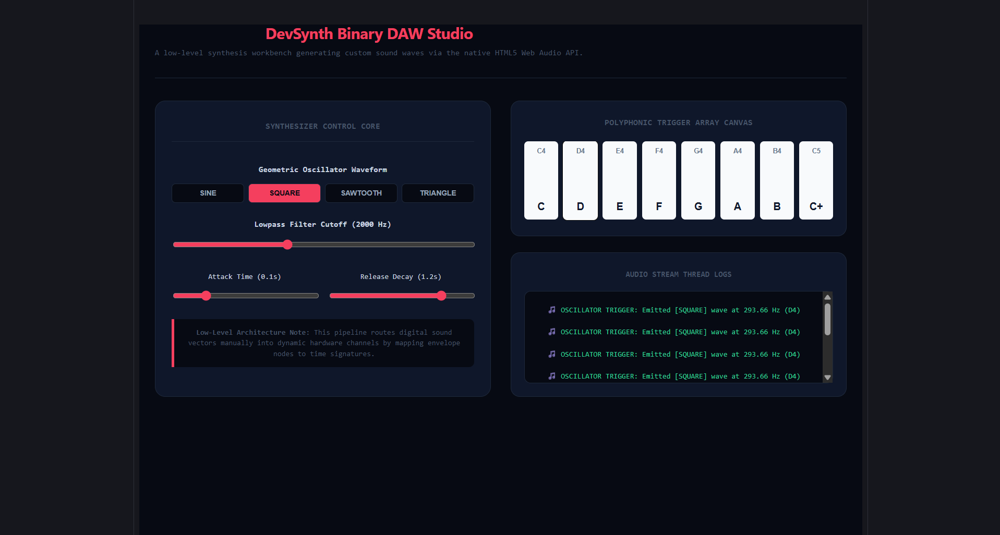

#  DevSynth — Low-Level Digital Audio Workstation & Synth Core (React)
------------------------------------------------------------------------------------------

DevSynth is a real-time reactive sound profiling sandbox engineered using React components. It hooks straight into hardware sound nodes via the native HTML5 Web Audio API, compiling custom geometric frequencies onto dynamic hardware nodes, managing linear time envelope values (`gainNode`), and capturing low-level buffer parameters live.

## Preview
----------------------------------------------------------------------------------------

##  Technical Highlights Explored
----------------------------------------------------------------------------------------

*  **Web Audio Hardware Topologies:** Skips bulky external rendering suites entirely, creating native oscillator and filter node connections directly on the browser execution engine threads.
*  **Time-Series Audio Envelopes:** Synchronizes audio parameters cleanly within millisecond time stamps, executing linear ramp shifts to eliminate static click artifacts.

---------------------------------------------------------------------------------------------

1. Setup package assets: `npm install`
2. Launch profiling console DAW: `npm run dev`

--------------------------------------------------------------------------------------------------
